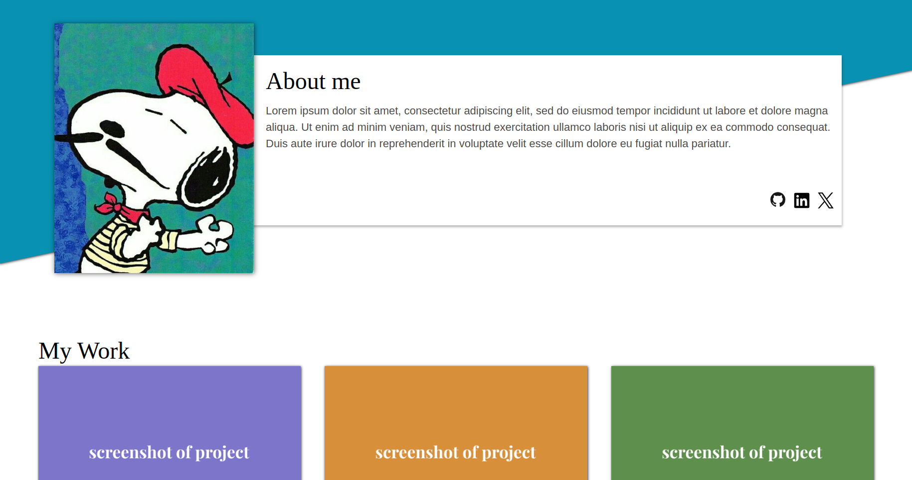

# Odin Homepage

This project is part of [The Odin Project's](https://www.theodinproject.com/) curriculum for practicing advanced HTML and CSS by building a responsive homepage. The main focus was to achieve responsive behavior, ensuring the layout adapts seamlessly to various screen sizes and devices. This required adopting a mobile-first design approach and effectively manaing different breakpoints while leveraging natural HTML responsiveness

## Website Link

Visit the live website [here](https://github.com/PauloMBorges/odin-homepage).
